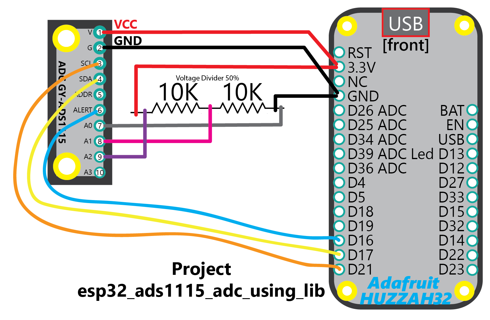

## Project Description
This project demonstrates the basics of using the MJD ESP-IDF component "mjd_ads1115" for the ESDP32 and the popular breakout boards of the **TI ADS1115 Ultra-Small, Low-Power, I2C-Compatible, 860-SPS, 16-Bit ADCs With Internal Reference, Oscillator, and Programmable Comparator** using the **I2C Bus**.

Go to the component directory "components/mjd_ads1115" for more documentation, suggested breakout boards (if relevant), installation and wiring instructions, data sheets, FAQ, photo's, etc.


## Lab Setup

The idea is to observe how accurately the ADC will measure the voltage of GND, VCC and the voltage across the voltage divider (should be 50%).

The hardware setup consists of an ESP32 development board (Adafruit HUZZAH32), an ADS1115 ADC breakout module, and a 50% voltage divider setup using 2x 10K Ohm resistors.

A 10K potentiometer can also be used, instead of the voltage divider using 2 resistors.


## Wiring Diagram
```
ADS1115 PIN LAYOUT:

PIN#  PIN NAME  Description
----  --------  -----------
 1    V VCC     Power supply (3.3V for the ESP32)
 2    G GND     Ground
 3    SCL       I2C Serial Clock
 4    SDA       I2C Serial Data
 5    ADDR      I2C slave address select
 6    ALR/RDY   Comparator output or conversion ready
 7    A0        Analog input 0
 8    A1        Analog input 1
 9    A2        Analog input 2
10    A3        Analog input 3
```



```
WIRING DIAGRAM: MCU - ADS1115:

ADS1115 PIN  MCU PIN
-----------  -------
V VCC        VCC 3.3V
G GND        GND
SCL          21
SDA          17
ADDR         --
ALR/RDY      16
```


```
WIRING DIAGRAM: VOLTAGE DIVIDER - ADS1115:

ADS115 PIN  VOLTAGE DIVIDER
----------  ---------------
A0          The GND side of the Voltage Divider
A1          The middle point of the Voltage Divider between the 2 resistors
A2          The VCC side of the Voltage Divider 
A3          --
```


## Running the example

- Run `make menuconfig` and modify the GPIO PIN#'s that you want to use in the section "MY PROJECT CONFIGURATION". @tip You can also change the log level in Components->Logging: use level INFO for normal operation, use level DEBUG for more detailed logging and to get insights in what the component is actually doing.
- Run `make flash monitor` to build and upload the example to your board and connect to its serial terminal.


## An extract of the UART Debugging Output

```
...
I (2419) mjd_ads1115: ADS1115 Log Device Params (*Read again from registers*):
I (2439) mjd_ads1115:   OPSTATUS:    0x1 0b00000001 (1)
I (2439) mjd_ads1115:   MUX:         0x4 0b00000100 (4)
I (2439) mjd_ads1115:   PGA:         0x1 0b00000001 (1)
I (2449) mjd_ads1115:   OPMODE:      0x1 0b00000001 (1)
I (2449) mjd_ads1115:   DATARATE:    0x0 0b00000000 (0)
I (2459) mjd_ads1115:   COMPARATORMODE:     0x0 0b00000000 (0)
I (2469) mjd_ads1115:   COMPARATORPOLARITY: 0x0 0b00000000 (0)
I (2469) mjd_ads1115:   LATCHINGCOMPARATOR: 0x0 0b00000000 (0)
I (2479) mjd_ads1115:   COMPARATORQUEUE:    0x2 0b00000010 (2)
I (2489) mjd_ads1115:   LOWTHRESHOLD:  0x0 0b0000000000000000 (0)
I (2489) mjd_ads1115:   HIGHTHRESHOLD: 0xFFFF 0b1111111111111111 (65535)
I (2499) mjd_ads1115:   CONVERSIONREADYPININLOWREG: 0x0 0b00000000 (0)
I (2509) mjd_ads1115:   CONVERSIONREADYPININLOWREG: 0x1 0b00000001 (1)
I (2519) mjd: *** 19700101000002 Thu Jan  1 00:00:02 1970
I (2519) myapp: LOOP: NBR_OF_RUNS 100
I (2529) myapp:   ***ADS1115 MEAS#1***
I (2669) myapp:     A0: raw_value (signed int16):     0 | volt_value (float): 0.000
I (2799) myapp:     A1: raw_value (signed int16): 13220 | volt_value (float): 1.653
I (2929) myapp:     A2: raw_value (signed int16): 26411 | volt_value (float): 3.301
I (2929) myapp:   ***ADS1115 MEAS#2***
I (3059) myapp:     A0: raw_value (signed int16):     0 | volt_value (float): 0.000
I (3189) myapp:     A1: raw_value (signed int16): 13220 | volt_value (float): 1.653
I (3319) myapp:     A2: raw_value (signed int16): 26412 | volt_value (float): 3.302
. . .
. . .
I (40759) myapp:   ***ADS1115 MEAS#99***
I (40889) myapp:     A0: raw_value (signed int16):     0 | volt_value (float): 0.000
I (41019) myapp:     A1: raw_value (signed int16): 13221 | volt_value (float): 1.653
I (41149) myapp:     A2: raw_value (signed int16): 26412 | volt_value (float): 3.302
I (41149) myapp:   ***ADS1115 MEAS#100***
I (41279) myapp:     A0: raw_value (signed int16):     0 | volt_value (float): 0.000
I (41409) myapp:     A1: raw_value (signed int16): 13220 | volt_value (float): 1.653
I (41539) myapp:     A2: raw_value (signed int16): 26413 | volt_value (float): 3.302
I (41539) mjd_ads1115: ADS1115 Log Device Params (*Read again from registers*):
I (41549) mjd_ads1115:   OPSTATUS:    0x1 0b00000001 (1)
I (41549) mjd_ads1115:   MUX:         0x6 0b00000110 (6)
I (41549) mjd_ads1115:   PGA:         0x1 0b00000001 (1)
I (41559) mjd_ads1115:   OPMODE:      0x1 0b00000001 (1)
I (41569) mjd_ads1115:   DATARATE:    0x0 0b00000000 (0)
I (41569) mjd_ads1115:   COMPARATORMODE:     0x0 0b00000000 (0)
I (41579) mjd_ads1115:   COMPARATORPOLARITY: 0x0 0b00000000 (0)
I (41589) mjd_ads1115:   LATCHINGCOMPARATOR: 0x0 0b00000000 (0)
I (41589) mjd_ads1115:   COMPARATORQUEUE:    0x2 0b00000010 (2)
I (41599) mjd_ads1115:   LOWTHRESHOLD:  0x0 0b0000000000000000 (0)
I (41609) mjd_ads1115:   HIGHTHRESHOLD: 0xFFFF 0b1111111111111111 (65535)
I (41609) mjd_ads1115:   CONVERSIONREADYPININLOWREG: 0x0 0b00000000 (0)
I (41619) mjd_ads1115:   CONVERSIONREADYPININLOWREG: 0x1 0b00000001 (1)
I (41629) myapp: REPORT:
I (41629) myapp:   NBR_OF_RUNS:       100
I (41639) myapp:   nbr_of_adc_errors: 0
I (41639) myapp:     PIN  avg_volt_value min_volt_value max_volt_value
I (41649) myapp:     ---  -------------- -------------- --------------
I (41649) myapp:     A0            0.000          0.000          0.000
I (41659) myapp:     A1            1.653          1.653          1.653
I (41669) myapp:     A2            3.302          3.301          3.302
I (41679) mjd: *** 19700101000041 Thu Jan  1 00:00:41 1970
/

```


## Reference: the ESP32 MJD Starter Kit SDK

Do you also want to create innovative IoT projects that use the ESP32 chip, or ESP32-based modules, of the popular company Espressif? Well, I did and still do. And I hope you do too.

The objective of this well documented Starter Kit is to accelerate the development of your IoT projects for ESP32 hardware using the ESP-IDF framework from Espressif and get inspired what kind of apps you can build for ESP32 using various hardware modules.

Go to https://github.com/pantaluna/esp32-mjd-starter-kit


